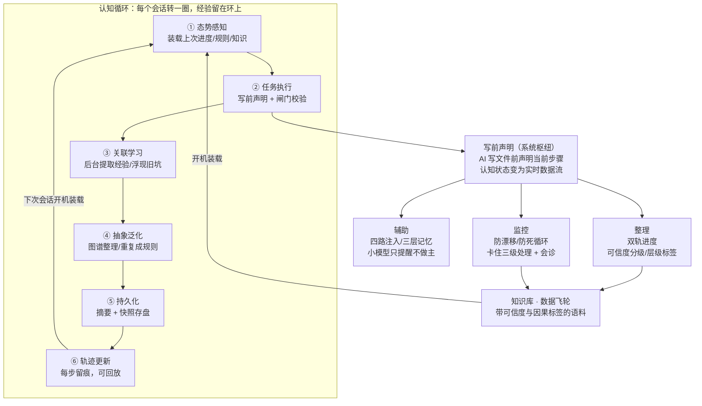

<div align="center">

# CLS 认知操作系统

**让 AI 的思维过程透明、可审计、可复用**

把 AI 的工作过程组织成循环：写文件前声明当前步骤（枢纽），<br>
监控、辅助注入、知识整理三个消费端基于声明信号运行，<br>
经验沉淀成带可信度分级的语料，形成数据飞轮，加速科研。

[快速验证](#快速验证) · [深入文档](docs/) · [论文](paper/main.pdf) · [English](README_EN.md)

[](https://doi.org/10.5281/zenodo.20830497)

</div>

---

## 结构图



---

## 核心目的

让 AI 的思维过程**透明、可审计、可复用**。

AI 干活的过程是黑盒：它在想什么、有没有偏离目标、卡在哪一步、这轮学到了什么——外面看不到，会话一关全部丢失。现有开源项目集中在记忆检索层（存什么、取什么），没有人管**过程**（干得对不对、卡没卡、记没记）。

CLS 的做法：把 AI 的工作过程组织成一个**循环**，每转一圈留下结构化记录，经验沉淀在环上。安全拦截和人格边界是附带功能，不是本项目重点。

下面按实现机制逐个展开。

---

## 一、写前声明：系统的枢纽

### 规则

AI 每次写文件之前，必须先声明"这一步在做什么"。声明是一句话，说明当前步骤的目的，例如：

```
声明: phase=2, label="修复编码错误", description="trajectory 中文乱码，改 stdin 解码为 UTF-8"
```

声明写入共享状态文件 `cog_step.json`，有效期 300 秒。写文件前的钩子检查这个文件：

| 检查项 | 结果 | 原因 |
|--------|------|------|
| 没有声明 | 拒绝 | 没有说明意图 |
| 声明超过 300 秒 | 拒绝 | 五分钟前的意图不代表现在的意图 |
| 声明是系统自动补写的 | 拒绝 | 自己的话不能由系统代签 |
| 另一个窗口的声明 | 放行并记录 | 多窗口共用同一个声明文件是设计行为 |
| 写入 temp/ 等临时路径 | 放行 | 临时文件不算产出 |

拒绝信息中附带完整的声明命令，AI 可以直接复制执行。

### 为什么这是整个系统的枢纽

这条纪律的价值不在管住 AI，在于**它让系统持续获得 AI 最新的认知状态**。

没有声明机制时，AI 的"想法"只存在于对话文本里——杂乱、滞后、难以程序化利用。有了声明，AI 的认知过程变成一条**实时、结构化、机器可读的数据流**：

- 监控端读它，判断 AI 是否偏离目标、是否卡住
- 辅助端读它，决定此刻注入哪条知识和记忆
- 整理端读它，把"这一步为什么做"存进知识库

后面三节的所有机制，都消费这个信号。

### 双向绑定

声明落文件（机器可校验），同时 AI 回复的首行写同标签的锚点（`ANCHOR: ②修复编码错误`）。文件是闸门的依据，锚点跟随对话历史、压缩后仍在。两者互证：闸门查文件，注意力看锚点。

### 实测：AI 被拒后会自己补声明

在一个从未接触过这套系统的 AI 运行时上测试，写文件被拒（声明过期）后，它的完整行为序列：

```
第 1 步：write 文件          → 被拒（声明过期）
第 2 步：调用声明工具，写明"写入探测内容" → 声明成功
第 3 步：write 同一文件      → 放行
```

拒绝信息里给的是命令行方式，它自己找到了更顺手的声明工具。结论：**规则清晰且给出路时，AI 会走正道**——正道比绕过去省事。

---

## 二、认知循环：六步怎么转

每个会话转一圈，经验留在环上。

### ① 态势感知（会话启动时）

系统自检状态，做"开机装载"，一次性注入三样东西：

- **上次的进度**：读进度文件尾部（上次做到哪、下一步计划是什么）
- **常用规则**：从规则文档提取的高优先级纪律清单
- **相关知识**：按当前任务关键词，从知识卡片库选最多 5 张相关卡片

效果：新会话从"上次的自己"继续，不从零开始。

### ② 任务执行（每次写文件前）

写前声明 + 闸门校验（见第一节）。

### ③ 关联学习（对话进行中）

两个动作：

- **自动收藏**：每 10 轮工具调用，一个后台小模型从对话中提取可复用的经验（结论、教训、坑），写入记忆文件。主模型完全不知道这件事——两个模型互不知晓，防止知识自我强化污染
- **知识联想**：AI 正在做的操作与知识库中以前踩过的坑匹配时，把旧坑浮现给当前会话。例如正在改编码相关代码时，自动浮现"上次中文乱码的根因是 GBK 解码"

### ④ 抽象泛化（定时任务）

每 30 分钟，知识图谱增量构建：把③存下的零散经验归类、建索引、算关联。**同样的事发生两次，提炼成可复用规则**——例如两次踩同一个编码坑，就生成一条规则卡片，下次①的装载会带上它。

### ⑤ 上下文持久化（会话结束前）

把当前工作状态压缩存盘：任务摘要、关键决策、未完成事项、快照。下次会话①的装载读的就是它。相当于"休眠"——内存里的状态存进磁盘，开机原样恢复。

### ⑥ 轨迹更新（每次工具调用后）

三轨日志同时记录：谁（会话）、何时、动了什么文件、结果如何。每条轨迹带**层级标签**（见第四节）。系统崩了或结果错了，能回放当时发生了什么。

---

## 三、监控：防漂移、防死循环、处理卡住

### 任务漂移检测

AI 的当前操作与任务锚点做相似度比较。**任务锚点只从状态文件取**（目标文件、认知声明、态势文件），不从对话原文取——对话原文里混着人格设定等内容，比对会失真（这是踩过 76 条误报的坑换来的规则，见事故表）。

相似度过低时提示回归原任务，每个会话最多提示一次。

### 卡住检测：三个信号

全部来自⑥的操作日志，纯规则计算，不调用模型：

| 信号 | 判定 | 说明 |
|------|------|------|
| 同一文件被改 3 次以上 | 卡住 | 含 bash 方式修改（sed、重定向、Set-Content 都算"改"） |
| "修改→验证"交替 2 次以上 | 卡住前兆 | 验证 = 读文件**或跑测试**——真实 AI 验证靠跑测试，不只靠读 |
| 同一命令连续失败 3 次以上 | 卡住 | |

### 三级处理

**第一级（轻度卡住）——注入换策略指令，不拦截：**

> 停止继续改代码。①列出至少 2 个根因假设 ②每个假设写一个验证方法 ③挑成本最低的先验证。验证通过才允许再改。

每个会话最多注入一次。

**第二级（确认卡死）——拦截，拦截信息是作业题：**

> 请提交四段说明：①已试过什么 ②为什么失败 ③你怀疑的根因是什么 ④这次为什么不一样。

**第三级（会诊）——AI 交作业，外部模型给意见：**

AI 提交四段说明后，一个免费档的小模型（Qwen 7B）以同事口吻回复，例如实测回复：

> 你第二个假设站不住脚——你已经在改显示层了，说明问题在更早的解析层。建议先验证输入编码是不是 GBK，再改代码。

意见注入回会话，同时发一张 10 分钟通行证，写入恢复。复核通道挂了就发 5 分钟短通行证并标记——**求助通道自己不能变成死锁源**。

**生产数据**：上线第一个周末，在真实科研任务（MATLAB <传感器>分析、LaTeX 编辑、Python 绘图）中自然触发 5 次，无人值守，AI 每次都交了作业并按复核意见调整方向。

---

## 四、辅助：注入知识和记忆

### 四路注入（按时机）

| 通道 | 时机 | 注入什么 |
|------|------|---------|
| 开机装载 | 会话启动 | 上次进度 + 规则 + 相关知识卡片 |
| 分级注入 | 每轮用户输入 | 按任务复杂度（推理/编码/审查/摘要四级）给对应的工作方法提示 |
| 定向建议 | 每次工具调用后 | 针对刚发生的操作给建议（如"该文件已修改 3 次，修复超过 3 轮不会收敛"） |
| 知识联想 | 操作匹配到旧知识时 | 以前踩过的坑 |

### 三层记忆

| 层 | 类比 | 机制 |
|----|------|------|
| 常驻 | 开机自启的程序 | 高优先级规则全量注入，永远在场 |
| 需要时打开 | 用的时候再开的软件 | 记忆索引常驻，正文按需读取 |
| 后台推送 | 推送通知 | 小模型把可能相关的 3-5 条候选塞进来，标注"请自行判断" |

**小模型只提醒，不做主**——相关性候选由便宜的小模型给，用不用、怎么用由大模型决定。小模型判断质量有上限，决定权不能交给它。

### 防刷屏三问（每条注入出生前必过）

1. AI 自己能想到吗？能想到就不说。
2. 对当前这一步有新信息吗？没有就不说。
3. 十分钟后还有意义吗？没有就不说。

慢性状态类提醒（如"有结论 7 天没复核"）额外加：内容不变则不重复、同一清单最多每 30 分钟提醒一次、首次只记录不吭声。这些规则全部来自上线当天刷屏逼死会话的事故（见事故表）。

---

## 五、整理：数据飞轮

### 双轨进度：一次书写，两份落盘

AI 记进度时写一次，系统落两份：

- **人类读的一份**：正常叙述的日志
- **机器读的一份**：结构化字段（结论/教训/亮点/决策/困难/来源），机器可批量解析

结构化由正在干活的 AI 当场完成，不需要事后用小模型重新提炼——干活时顺手结构化，质量最高成本最低。

### 可信度分级：每条结论标注"凭什么信"

| 级别 | 含义 | 处理 |
|------|------|------|
| human_confirmed | 人类在对话中明确确认 | 最高可信，记录原话 |
| hard_gate | 硬验证通过（编译过、测试绿、多轮调试后成功） | 高可信 |
| model_authored | AI 自己推断的 | 最低可信，7 天没人复核就翻出来提醒 |

为什么较真：这些记录最终是**未来模型的微调语料**。带错误结论的语料训出的模型是放大版的错误。

### 层级标签：记录"这一步是哪层做的决定"

每条轨迹标注：

| 标签 | 含义 | 判定依据 |
|------|------|---------|
| reflex | 被闸门拦后的反应 | 15 秒内有拦截记录 |
| rhythm | 听了注入建议后做的 | 30 秒内有注入记录 |
| strategy | 任务目标变更驱动 | 60 秒内态势文件被写过 |
| human | 人类直接指令 | 120 秒内有人类输入 |

纯规则推断，零模型调用；证据不足就不标，不猜。

### 飞轮逻辑

普通对话记录微调出的模型，只学会"发生了什么"——它是平的。带层级标签（因果）、可信度分级（凭什么信）、人类裁决（对错）的记录，才有希望训出"卡住会换思路、结论讲证据"的模型。系统每天运行都在生产这种语料——**日志不是记给现在的，是写给未来那个模型的**。

---

## 六、多运行时：两台机器一个脑子

整套循环（声明、监控、辅助、整理）已移植到第二个 AI 运行时（DeepSeek Harness，13 个插件）。

移植方式不是复制代码，是**两个运行时读写同一批状态文件**：声明写进同一个 `cog_step.json`，会诊通行证两边互认，知识库共用。AI 在哪边干活，哪边声明，两边同时放行。

移植中验证的教训：**搬机制先看数据长相，别看逻辑像不像。**有个组件照搬后疯狂误报，排查发现两个运行时传给它的对话格式根本不同——同一段代码，这边拿到的是"用户刚说的话"，那边拿到的是"包含人格设定的全部历史"。逻辑一字没改，含义全变。

---

## 附带功能：安全与人格

约二十道硬闸在每次工具调用前生效：自称有生命（人格边界）、编造模型名、密钥入库、危险删除命令、关闭杀毒软件等，命中即拒。这部分是基础设施，不是本项目核心贡献。

---

## 已记录的生产事故

| 事故 | 根因 | 修复 |
|------|------|------|
| 一道拦截闸上线一个月从未生效 | 输出格式错误 + 系统按"闸门故障即放行"设计，坏得无声 | 闸门输出定期用真实数据验证可解析性 |
| 提醒功能上线当天每轮刷屏 | 慢性状态项永远清不空，每轮重复注入 | 内容去重 + 30 分钟冷却 + 首次静默 |
| 76 条漂移警告全部误报 | 任务锚点取自对话原文，混入人格文本 | 锚点只从状态文件取 |
| 知识库无限增长 | 只进不出，无过期复核 | 可信度分级 + 超期翻出 + 相似取代标记 |

事故全程记录在案。这些记录同时也是循环在运转的证据。

---

## 仓库结构

```
hooks/                     13 个钩子脚本（声明校验、安全检查、轨迹记录）
scripts/wheels/            41 个功能模块（注入/监控/记录/会诊/知识整理）
scripts/mcp_cls_tools.py   MCP 工具服务端（30 个工具，含声明与会诊）
scripts/core-engine/       三个独立演示模块（无需配置可直接运行）
runtimes/dsh/              DeepSeek Harness 移植（10 插件 + 3 会话桥）
model-training/           本地小模型训练全流程（脚本+数据+文档）
CLAUDE_templates/          配置模板
docs/                      深入文档（英文，含完整设计与事故记录）
```

## 本地小模型：自产微调

系统的分类、摘要、参数提取原来全部调用云端小模型。现在其中三类高频任务已由本机微调的 3B 小模型承担（RTX 4060 Laptop 8GB 显存训练）：

- **ep-json**：文本 → 严格 JSON，微调后合法率 100%
- **ep-mem**：对话 → 三字段记忆摘要
- **ep-param**：领域实验文本 → 参数提取

训练数据来自系统自身的知识库与运行记录——**数据飞轮的第一次兑现**：攒下的带可信度分级和溯源的记录，直接变成了训练语料。完整训练过程、8GB 显存配方和八条实战技巧见 [model-training/](model-training/)。

---

## 快速验证

无需任何配置，纯标准库：

```
python scripts/core-engine/stance.py selftest          # 声明档位机制
python scripts/core-engine/stuck_detector.py selftest  # 卡住检测
python scripts/core-engine/consult.py --selftest       # 会诊通道
```

正式部署：Windows 环境（钩子为 PowerShell），参照 `CLAUDE_templates/settings.json.template` 注册钩子，`GLOSSARY.md` 列出全部需要替换的路径占位符。

---

*在真实科研环境中开发与运行。MIT 协议。英文版见 [README_EN.md](README_EN.md)。*
